# reflbo

Firmware for the Waveshare [ESP32-S3-RLCD-4.2](https://docs.waveshare.com/ESP32-S3-RLCD-4.2): a battery-powered desk display with an always-on 4.2″ reflective screen. It shows dashboards like a watch face: the time, your room's climate, the weather and air quality, the sun, a rain radar and the aircraft overhead. Between updates it sleeps, with Wi-Fi off.

<p align="center">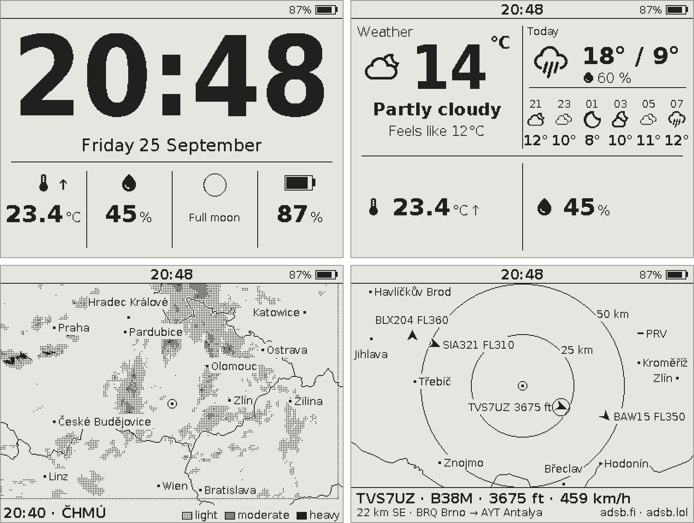</p>

**Status:** version 0.1.0-dev. Milestones M0 to M6b are built: dashboards and presets, the on-device menu, Wi-Fi with a web configurator, syncing, weather and air quality, both radars, and layouts of your own. MQTT and Home Assistant (M7) are designed; audio and microSD come after. The **[user guide](docs/guide.md)** describes every feature.

## Features

- **Dashboards.** Seven layouts and up to 16 presets. KEY switches them, an auto-cycle steps through them, and a schedule changes them by the time of day or turns the screen off for the night.
- **Your own layouts.** Split the screen into up to 8 cells on the web page, with a live preview drawn by the device.
- **Indoor climate.** Temperature and humidity with their trends, the dew point, and the day's low and high.
- **Weather and air.** From [Open-Meteo](https://open-meteo.com): now, today, the next hours and days, rain in the next 2 hours, air quality, PM2.5 and PM10, UV and pollen. Sunrise and sunset are computed on the device.
- **Weather radar.** Rain from ČHMÚ, or RainViewer outside its area, on a built-in world map, with the last hour as a loop.
- **Flight radar.** Aircraft from adsb.fi around a point you choose, with the nearest one's route.
- **Battery first.** Wi-Fi only for a sync, once a day by default; light sleep between the minute updates; a battery gauge that can learn its cell.
- **Accurate time.** NTP to the millisecond, a trim for the clock chip's drift, and time zones with daylight saving.
- **Set up from a phone.** The device's own Wi-Fi with a QR code, then a password-protected web configurator: presets, sync, location, radars, firmware updates with rollback, backup and restore.
- **Two buttons.** KEY and BOOT drive everything, including an on-device menu, in English or Czech.
- **Checkable without the device.** Every screen renders on the host, golden images guard each layout, and the USB console takes screenshots.

## Gallery

<table>
<tr>
<td>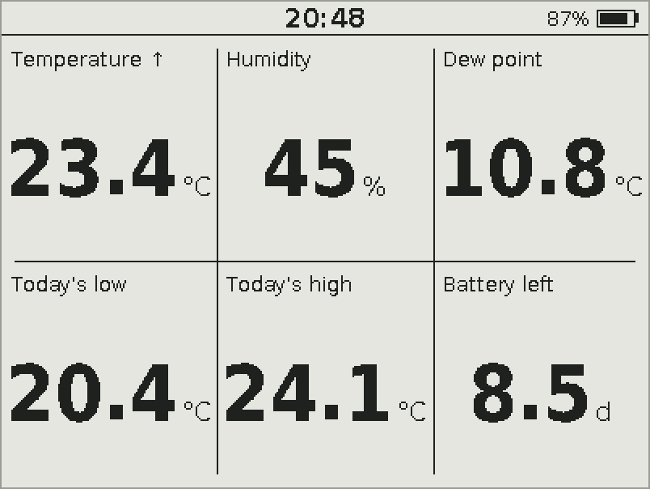<br>Indoor climate in the Grid layout</td>
<td>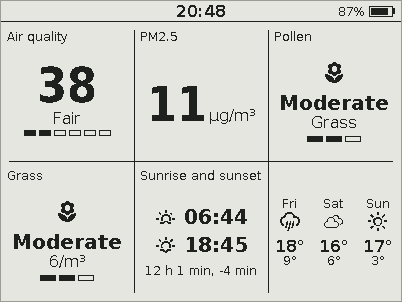<br>Air quality, pollen, the sun and the days ahead</td>
</tr>
<tr>
<td>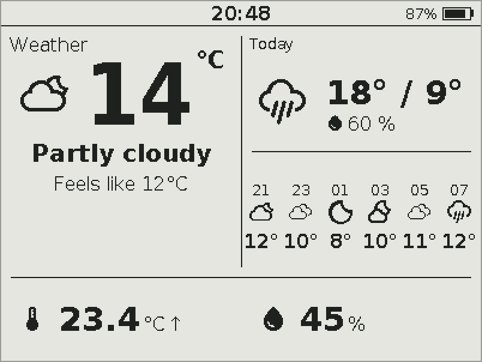<br>A layout of your own, split on the web page</td>
<td>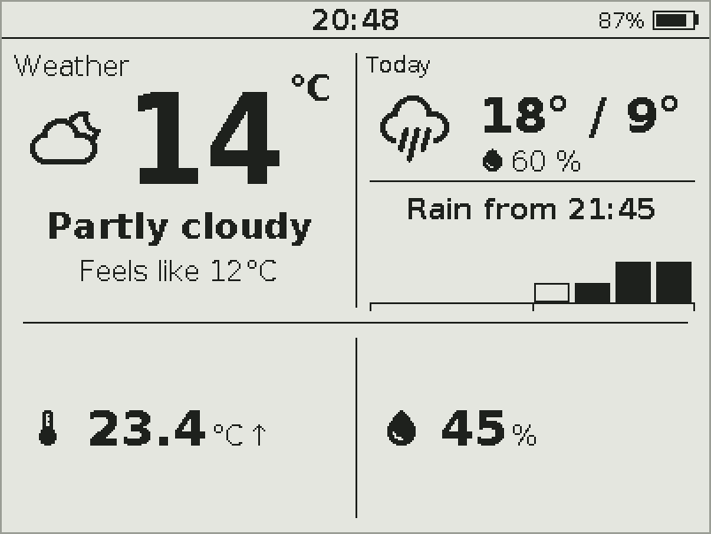<br>Rain in the next 2 hours</td>
</tr>
<tr>
<td>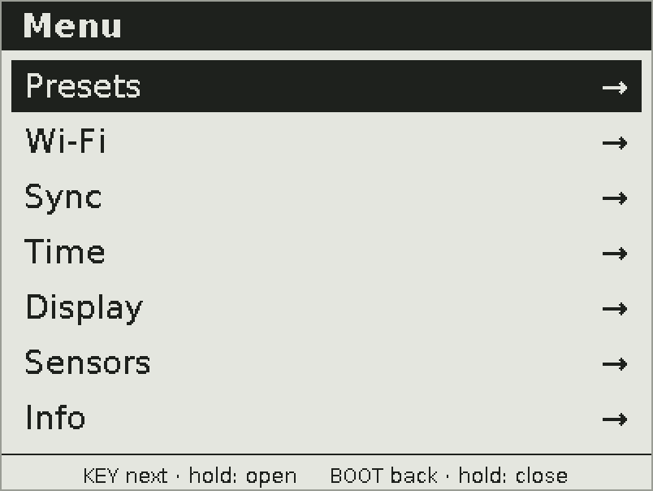<br>The menu, driven by two buttons</td>
<td>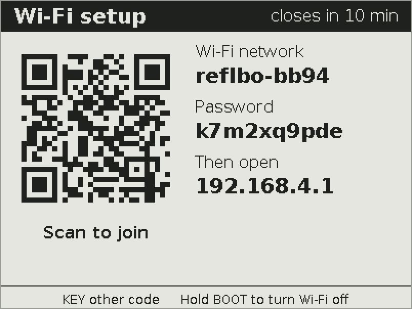<br>Wi-Fi setup: scan the code with a phone</td>
</tr>
</table>

The web configurator, on a phone:

<p>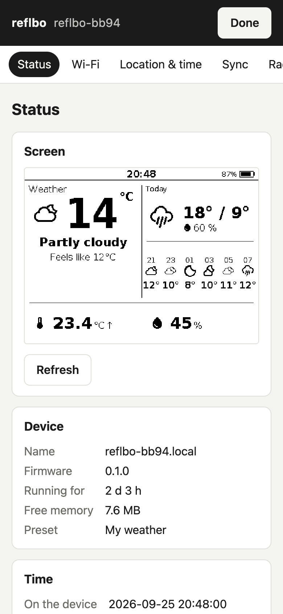 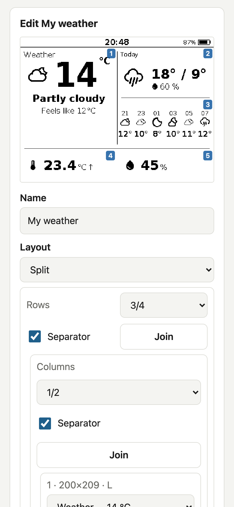 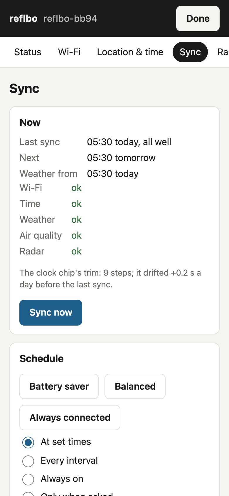 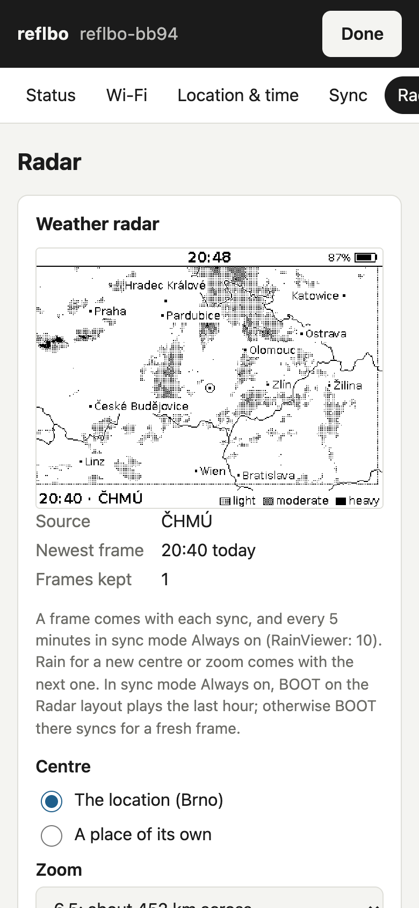</p>

The images are the firmware's own output: the panel images are its golden renders, pixel for pixel what the device draws, and the web pages ran against a demo device using the same renderer.

## Hardware

The Waveshare ESP32-S3-RLCD-4.2 and an 18650 cell; nothing to solder. An ESP32-S3 with 16 MB flash and 8 MB PSRAM, the ST7305 reflective LCD (400×300, 1-bit), an SHTC3 temperature and humidity sensor, a PCF85063 clock, a charger, and the KEY, BOOT and PWR buttons. The speaker, microphones and microSD slot wait for M8 and M9.

The board has no backup cell for the clock, so it forgets the time when switched off with PWR and fetches it at the next sync. A rechargeable ML1220 on connector J7 would keep it ([AGENTS.md](AGENTS.md) §3.4, gotcha 13).

## Getting started

1. Build and flash (below), or update over the web page once the device runs.
2. Insert a charged 18650, connect USB once to release its protection, and press PWR.
3. On the first-run screen, hold BOOT for 3 seconds. Scan the QR code with your phone, choose a password for the web page, and add your Wi-Fi network.

| Button | Short | Double | Long |
|---|---|---|---|
| KEY | Next preset | Auto-cycle on or off | Menu |
| BOOT | Read the sensors now | Sync mode Always on, or back | Wi-Fi setup (3 s) |

The [user guide](docs/guide.md) has the rest: every layout and field, the menu, the web pages, syncing, the radars, time and power.

## Power

The firmware wakes once a minute to redraw, about 60 ms each time, and turns Wi-Fi on once a day for a sync of 3 to 4 seconds. The stock board's 3.3 V converter is fixed in its forced-PWM mode, though, and draws about 60 mW whatever the firmware does: roughly 9 days on a 3400 mAh cell, an estimate from the measured floor. A board rework, the converter's PS/SYNC pin tied to ground, would remove most of that. Measurements are in [docs/power.md](docs/power.md).

## Documentation

- [User guide](docs/guide.md): every feature, with screenshots.
- [AGENTS.md](AGENTS.md): the developer's guide: status and roadmap, hardware notes, commands, verification and conventions.
- [Design spec](docs/specs/2026-09-25-firmware-design.md): the authoritative design, with every decision.
- [Plans](docs/plans/): how each milestone was built.
- [Power measurements](docs/power.md).

## Build and flash

Requires ESP-IDF v5.5.5. Setup is described in [AGENTS.md §6](AGENTS.md).

```sh
tools/idf.sh set-target esp32s3   # once per clone
tools/idf.sh build
tools/idf.sh -p /dev/cu.usbmodemXXXX flash
tools/idf.sh exec python tools/devlog.py --cmd version
```

Host tests, golden renders and the web page's tests:

```sh
cmake -S test/host -B build-host -G Ninja && cmake --build build-host && ctest --test-dir build-host
python3 tools/render.py          # every golden render as PNG, in captures/render
python3 tools/docs_images.py     # the panel images in docs/images from the goldens
```

## Roadmap

| Milestone | State |
|---|---|
| M0–M2: toolchain, display, clock, sensors and sleep | Done |
| M3: dashboards, presets, menu, night sleep, Czech | Done |
| M4: Wi-Fi, the web configurator, firmware updates | Built |
| M5: time sync, weather, air quality, the sync schedule | Built |
| M6: weather radar and flight radar | Built |
| M6b: layouts of your own, BOOT double for Always on | Built |
| M6c: smaller split cells, down to the status bar's size | Designed |
| M6d: solar forecast and the house's energy (SolaX Cloud) | Designed |
| M7: MQTT and Home Assistant | Designed, on hold until M6d |
| M8: alarms and internet radio | Planned |
| M9: microSD | Planned |

"Built" milestones wait for some of the owner's checks on the board; [AGENTS.md](AGENTS.md#2-status-and-roadmap) lists them.

## Data sources

The device fetches or carries data from these services and datasets:

- Weather, air quality, pollen and the place search: [Open-Meteo](https://open-meteo.com), CC BY 4.0.
- The weather radar: "Data: ČHMÚ, [opendata.chmi.cz](https://opendata.chmi.cz), CC BY 4.0"; outside ČHMÚ's area, [RainViewer](https://www.rainviewer.com).
- The flight radar: aircraft from [adsb.fi](https://adsb.fi), routes from [adsb.lol](https://adsb.lol).
- The built-in map: borders, coasts and towns from [Natural Earth](https://www.naturalearthdata.com) and airports from [OurAirports](https://ourairports.com), both public domain; more towns inside ČHMÚ's radar area from [GeoNames](https://www.geonames.org), CC BY 4.0.

## Licence

Apache-2.0. See [LICENSE](LICENSE), [NOTICE](NOTICE) and [THIRD_PARTY.md](THIRD_PARTY.md).
