# reflbo user guide

reflbo turns the Waveshare ESP32-S3-RLCD-4.2 into a battery-powered desk display. Its 4.2″ reflective screen is always on and shows dashboards like a watch face: the time, your room's climate, the weather, the sun, a rain radar, the aircraft overhead, your solar panels' forecast and the house's energy.

This guide covers what the firmware does today, version 0.1.0-dev (milestones M0 to M6d). [Coming next](#coming-next) lists what is designed or planned.

The images are the firmware's own output. The panel images are the host build's golden renders, which match the device pixel for pixel. The web pages ran against a demo device that draws its previews with the same renderer. On the device the screen is grey and reflective, lit by the room.

<p align="center"></p>

## Contents

- [The device](#the-device)
- [First start](#first-start)
- [Buttons](#buttons)
- [The dashboard](#the-dashboard)
- [Presets](#presets)
- [Your own layout](#your-own-layout)
- [Weather, air and the sun](#weather-air-and-the-sun)
- [Weather radar](#weather-radar)
- [Flight radar](#flight-radar)
- [Solar and the house's energy](#solar-and-the-houses-energy)
- [The menu](#the-menu)
- [Wi-Fi and the web configurator](#wi-fi-and-the-web-configurator)
- [Syncing](#syncing)
- [Time](#time)
- [Battery and power](#battery-and-power)
- [Languages](#languages)
- [Updates, backup and reset](#updates-backup-and-reset)
- [For developers](#for-developers)
- [Coming next](#coming-next)

## The device

| Part | What it does here |
|---|---|
| ESP32-S3, 16 MB flash, 8 MB PSRAM | Runs the firmware; Wi-Fi 2.4 GHz |
| 4.2″ reflective LCD, 400×300, 1-bit (ST7305) | Always on, readable in daylight, no backlight |
| SHTC3 | Room temperature and humidity |
| PCF85063 | The clock, which also wakes the board |
| 18650 cell holder and charger | Runs the board for days without a cable |
| KEY, BOOT and PWR buttons | KEY and BOOT drive everything; PWR switches the board on and off in hardware |
| Speaker, microphones, microSD slot | Not used yet: audio comes in M8, microSD in M9 |

The firmware sleeps between updates. It wakes once a minute to redraw, every 5 minutes to read the sensors, and once a day to sync over Wi-Fi. Wi-Fi is off the rest of the time.

## First start

1. Insert a charged 18650 and connect USB once, which releases the cell's protection. Press PWR.
2. The first-run screen appears. Press KEY to go to the dashboard, or hold BOOT for 3 seconds to set up Wi-Fi.
3. In Wi-Fi setup the screen shows the device's own network, its password and a QR code. Scan the code with your phone, or join `reflbo-XXXX` by hand, then open `http://192.168.4.1`. Many phones open the page on their own.
4. Choose a password for the web page, 8 to 64 characters. Only a phone on the device's own network can choose it.
5. On the Wi-Fi page, pick your network, type its password and tap Connect. The device tests it beside its own network, saves it and stays on it.
6. Saving the first network starts a sync, which fetches the time, the weather and the air quality. Tap Done when you have finished: Wi-Fi goes off.

<p>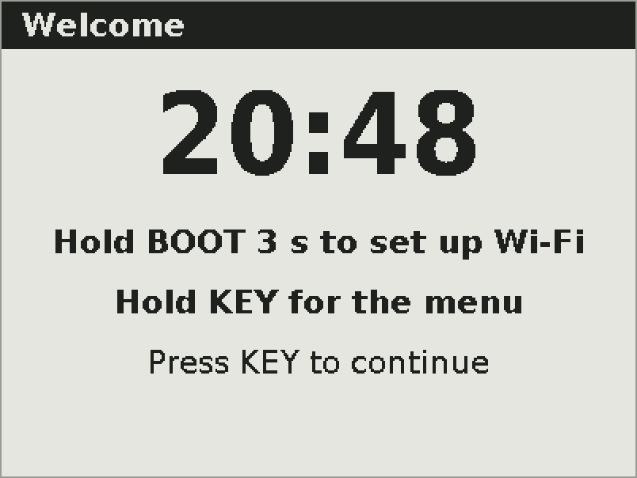 </p>

The device works without Wi-Fi too. It keeps the time with its clock chip, reads its sensors and computes the sun's times. Set the clock in the menu (Time ▸ Set date and time).

## Buttons

The firmware can read KEY and BOOT; PWR is a hardware switch. A press is short, double (two presses within 300 ms) or long (held 1 s). BOOT on the dashboard needs 3 s, so Wi-Fi doesn't come on by accident.

| Where | KEY short | KEY double | KEY long | BOOT short | BOOT double | BOOT long |
|---|---|---|---|---|---|---|
| Dashboard | Next preset | Auto-cycle on or off | Open the menu | Read the sensors now | Sync mode Always on, or back | Wi-Fi setup (3 s) |
| Rain radar | Next preset | Auto-cycle on or off | Open the menu | Play the last hour; outside Always on, sync for a fresh frame | Sync mode Always on, or back | Wi-Fi setup (3 s) |
| Menu | Next item | — | Open or select | Back | — | Close the menu |
| Menu, changing a value | + | — | Save | − | — | Cancel |
| Wi-Fi setup | Switch the QR code | — | — | — | — | Leave setup (1 s) |
| First run | Dashboard | — | Open the menu | — | — | Wi-Fi setup (3 s) |

Short messages confirm what a press did, such as "Preset: Weather". The menu closes by itself after 60 s without a press. During the night (see [Presets](#presets)) any press shows the dashboard for a minute.

<p>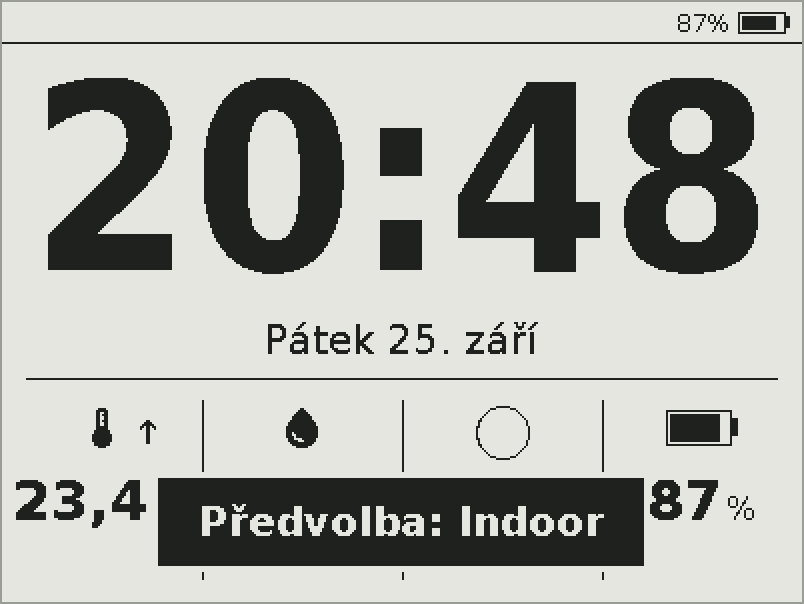</p>

## The dashboard

A dashboard is a layout with a field in each of its slots. Each field draws at the size its slot allows: a number that doesn't fit drops its decimals, then steps down to smaller digits, and text that doesn't fit ends in an ellipsis.

### The status bar

The top 20 pixels show the state of the device. On the left: "Set time" while the clock is lost, a stale mark when a value on screen is old, a globe while a phone is logged in to the web page, a sync mark while a sync runs, and a crossed-out cloud after a scheduled sync failed. In sync mode Always on, a Wi-Fi mark shows whether the device is on your network. In the middle a preset can show a small clock. On the right are the battery's level, voltage and days left (the level by default), and a bolt while it charges.

<p>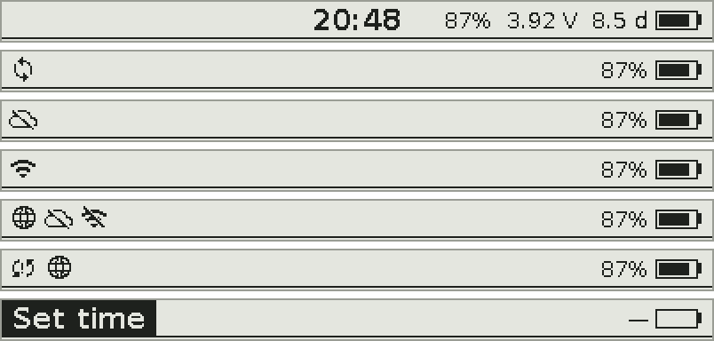</p>

### Layouts

| Layout | Slots |
|---|---|
| Classic | A large clock, the date, and four small slots below |
| Grid | Six medium slots, three by two |
| Weather | The weather now, today, the next hours, and two small slots |
| Focus | A large slot and two medium ones |
| Radar | The weather radar, full width |
| Flights | The flight radar, with the nearest aircraft below |
| Split | Your own arrangement of up to 24 cells ([Your own layout](#your-own-layout)) |
| Solar | Today's PV forecast with its chart, and the next two days ([Solar](#solar-and-the-houses-energy)) |
| Energy | The house's energy now as a flow, and today's totals |

<p>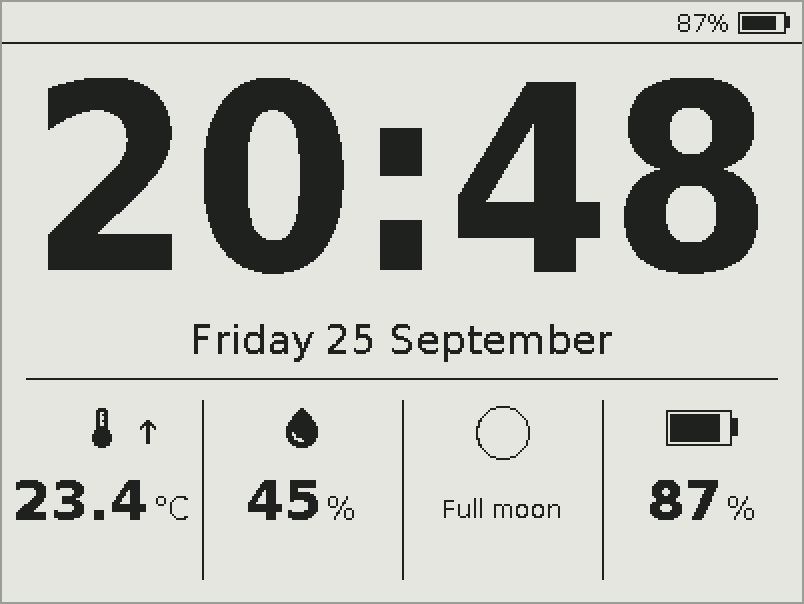 </p>
<p>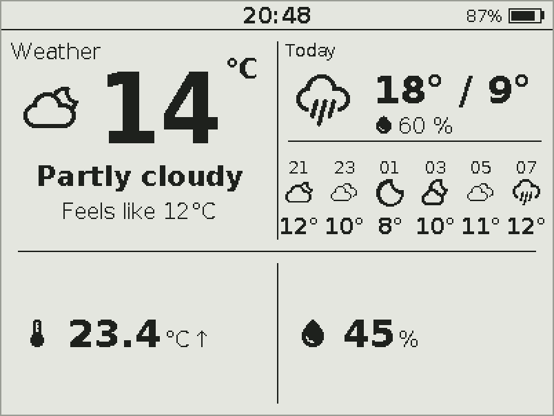 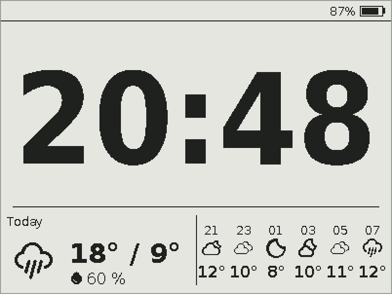</p>

### Fields

| Field | Shows |
|---|---|
| Time, Date, Week | The clock, the date, the ISO week |
| Moon phase | The phase and its name |
| Holiday, Name day | The day's public holiday or name day, from the language pack |
| Temperature, Humidity | The room, with ↑ or ↓ when it changed by more than 0.5 °C or 3 % in the last hour |
| Dew point, Today's low, Today's high | From the same sensor; the low and high reset at midnight |
| Battery, Battery left | The level (with the voltage and charging state in larger slots) and the days left at the current rate |
| Weather, Today, Next hours, Next days | The forecast: now, today's high, low and chance of rain, 12 hours, 3 days |
| Rain in 2 hours | Eight bars of 15 minutes, and "Dry for 2 h", "Rain from 21:45" or "Rain now · 1.2 mm/h" |
| Sunrise and sunset | The times, the day's length and its change since yesterday |
| Air quality, PM2.5, PM10, UV index | The European air quality index and its band, particles in µg/m³, the UV index and its band |
| Pollen | The strongest pollen today, or alder, birch, grass, mugwort, olive or ragweed alone |
| Rain map | The weather radar, cropped to the slot |
| Forecast now, today, tomorrow, Still to come, Peak | Your PV system's forecast: the output now, the day's totals, what today still brings, the peak and its time |
| Solar forecast | Today's output as a chart, a quarter hour a bar: what was produced so far, and the forecast for the rest |
| Solar, Grid, Home, Home battery | The house now: the panels' output, import or export, the house's use, the battery's charge and power |
| Produced today, To grid today, From grid today, Own use | Today's totals, and the share of the day's output the house used itself |
| Energy flow | The panels, the grid, the house and the battery as icons with arrows |

<p> 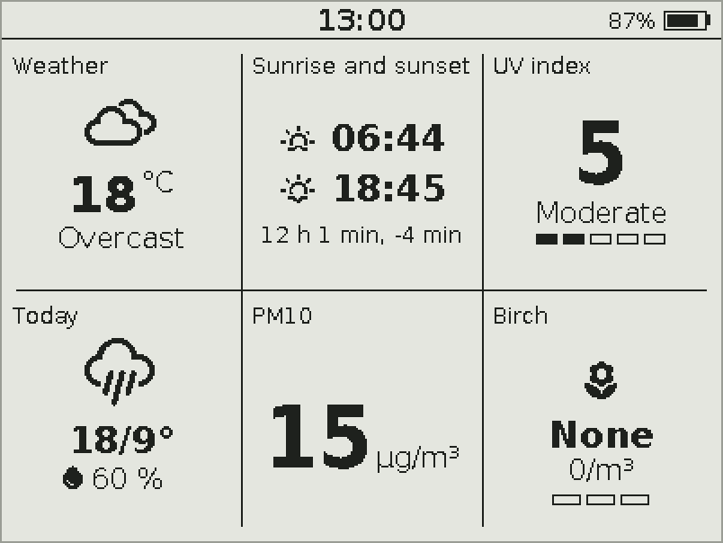</p>
<p> 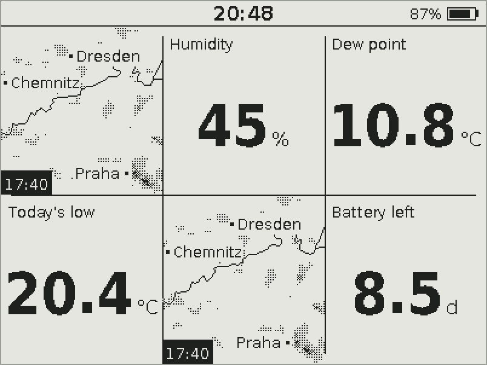</p>

### Options

Each preset can draw white on black, show seconds (which wakes the device every second and costs battery), use a 12- or 24-hour clock, and choose what old data looks like: shown with its age, a dash, or nothing. The weather counts as old 2 hours after the next sync was due, and sensor readings after 15 minutes.

<p>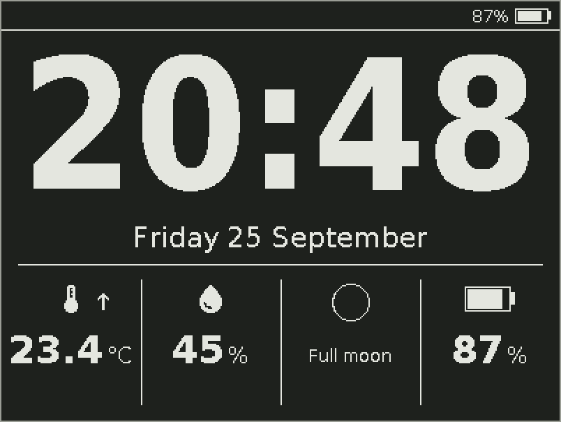 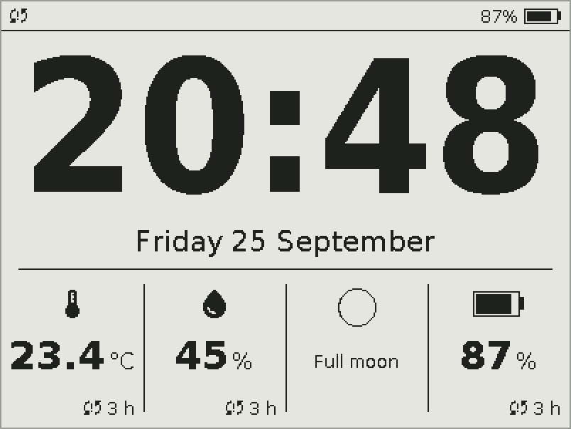</p>

## Presets

A preset is a layout, its fields and its options. The device holds up to 16. It comes with eight:

| Preset | Layout |
|---|---|
| Home | Classic: clock, date, temperature, humidity, moon, battery |
| Indoor | Grid: the room's climate and the battery, with a small clock |
| Weather | Weather |
| Focus clock | Focus |
| Rain radar | Radar |
| Flights | Flights; the cycle visits it only in sync mode Always on |
| Solar | Solar; outside the cycle until you add it |
| Energy | Energy; outside the cycle until you add it |

KEY steps through the presets marked "cycle". KEY double starts or stops the auto-cycle, which switches every 10 s to 1 h. A preset chosen by hand stays chosen after a restart.

The schedule switches presets at set times of day, on chosen days. It can also start a night: the screen goes blank and the device sleeps until the morning time, unless a button wakes it for a minute. Up to 8 entries.

Presets, the auto-cycle and the schedule are edited on the web page, with a live preview drawn by the device.

<p>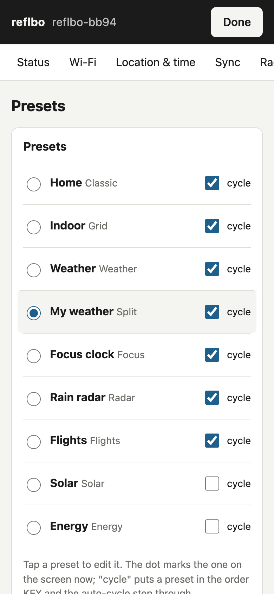 </p>

## Your own layout

The Split layout divides the screen under the status bar into rows or columns, at 1/4, 1/3, 1/2, 2/3 or 3/4. Each part can be split again, up to 24 cells of at least 40×20 pixels. Each split's line can be shown or hidden.

The editor shows each cell's size and offers only the fields that fit it. A field draws at the largest size its cell allows: a large clock needs the full width, while a temperature fits anywhere.

<p> 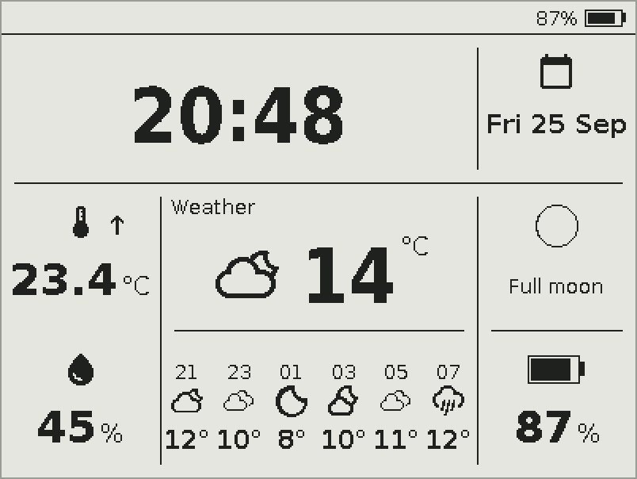</p>

Small cells draw a field the way the status bar does. A cell under 90 pixels wide or 40 tall shows it in one line, the icon then the value, or with the icon over the value in a narrow, taller cell; the date shows its weekday over its day. A short cell, under 80 pixels tall, puts the icon beside the value. Before anything is cut, a value gives way: a shorter form, a smaller face, then its unit or its icon. A stale value's age mark appears only where it has room; the status bar's warning stands for it in small cells.

<p>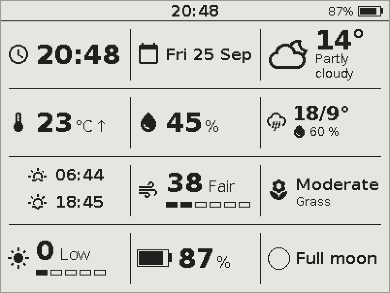 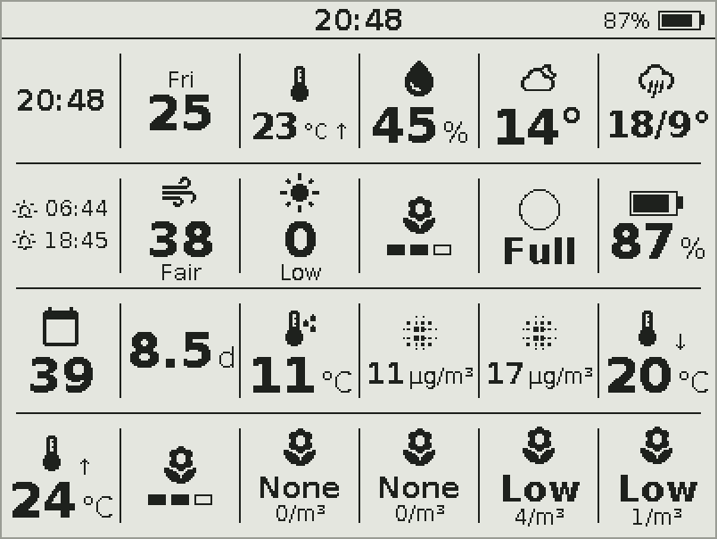</p>

## Weather, air and the sun

Each sync fetches a 3-day forecast and the air quality from [Open-Meteo](https://open-meteo.com), which needs no account. The device keeps them, so the weather stays useful all day after a single morning sync: "now" uses the current conditions for an hour, then the forecast for the hour.

- Weather: the condition and its icon, the temperature and how it feels; today's high, low and chance of rain; 12 hours and 3 days ahead.
- Rain in the next 2 hours, in 15-minute steps.
- Air quality: the European index, PM2.5 and PM10 for the hour; the UV index; pollen, in Europe and in season.
- Sunrise, sunset and the day's length are computed on the device for your location, so they work without Wi-Fi. Near the poles they say "polar day" or "polar night".

Set the location on the web page, by name or by coordinates. The default is Brno.

<p>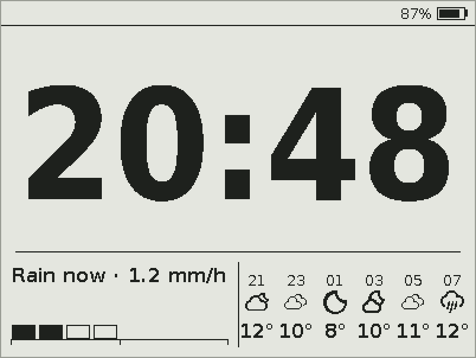</p>

## Weather radar

The Rain radar preset shows rain on a map, from the [Czech Hydrometeorological Institute](https://opendata.chmi.cz) (ČHMÚ) inside its area, Czechia and around, and from [RainViewer](https://www.rainviewer.com) elsewhere. Rain shows at three strengths, as dot patterns from sparse to solid. The map is built in: borders, coasts, towns and airports for the whole world.

A new frame comes with each sync. Its time and source show at the bottom left, inverted once the frame is older than 30 minutes. In sync mode Always on a frame comes every 5 minutes, and BOOT plays the last hour. Outside Always on, BOOT syncs for a fresh frame.

The radar's centre and zoom are set on the web page's Radar page. The rain map also fits in medium and large slots of other layouts.

<p>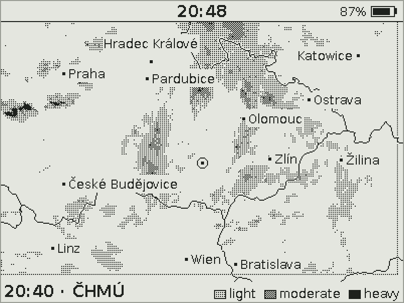 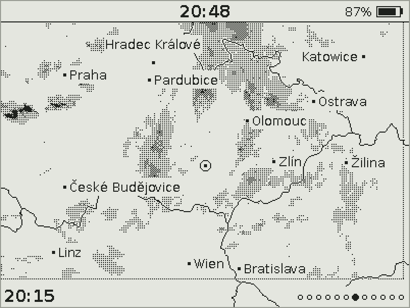</p>
<p>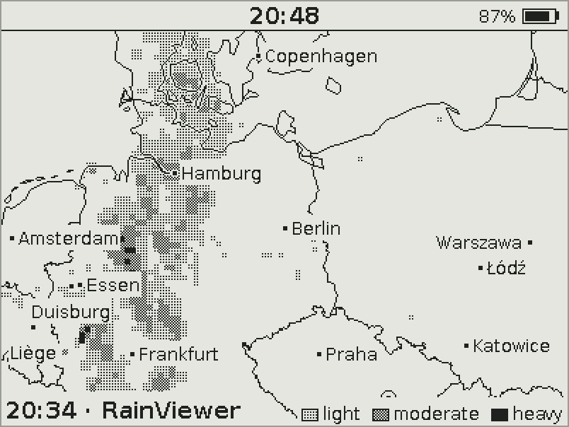</p>

## Flight radar

The Flights preset shows the aircraft around a centre, from [adsb.fi](https://adsb.fi): each as an arrow with its callsign and flight level, inside rings at half the range and the full range. The panel below names the nearest one with its type, altitude, speed, distance and direction, and its route from [adsb.lol](https://adsb.lol).

It runs only in sync mode Always on, while its view is on the screen, as it asks for new positions every 5 to 15 seconds. The range is 10 to 100 km, and the Radar page sets the centre and the filters: the lowest altitude, aircraft on the ground, and how many at most.

<p>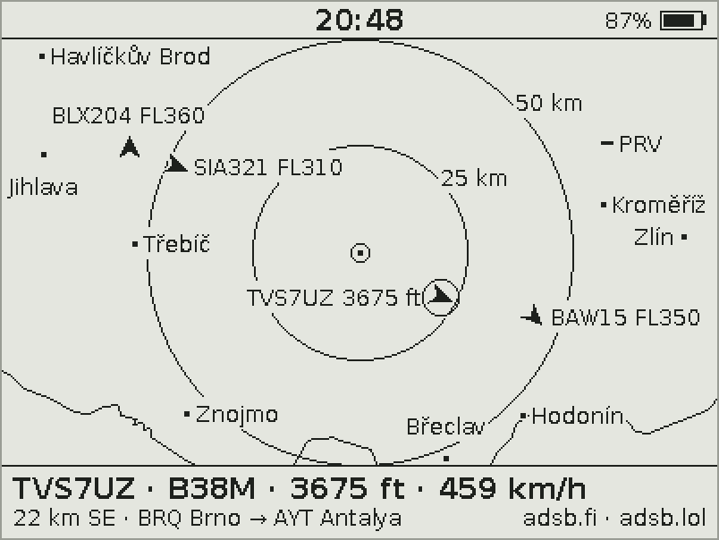 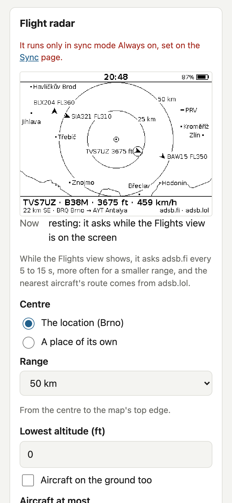</p>

## Solar and the house's energy

The Solar preset shows your PV system's forecast for the day, and the Energy preset what the house does with its power right now. Both are set up on the web page's Solar page, and their fields fit in any other layout too.

<p>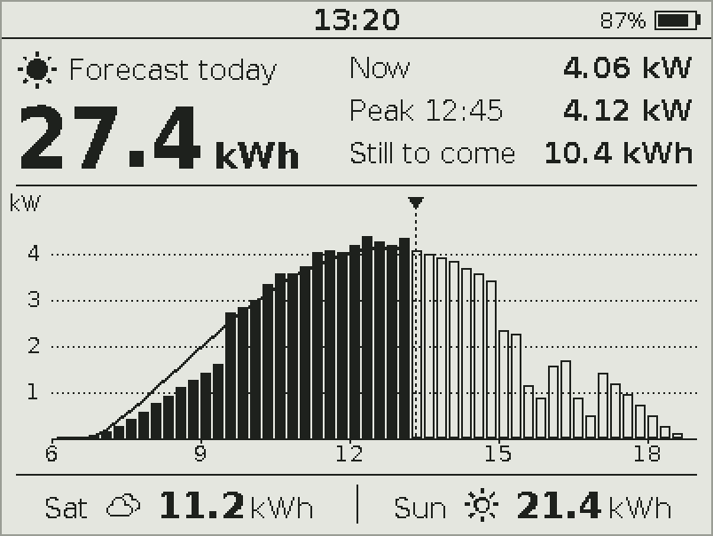 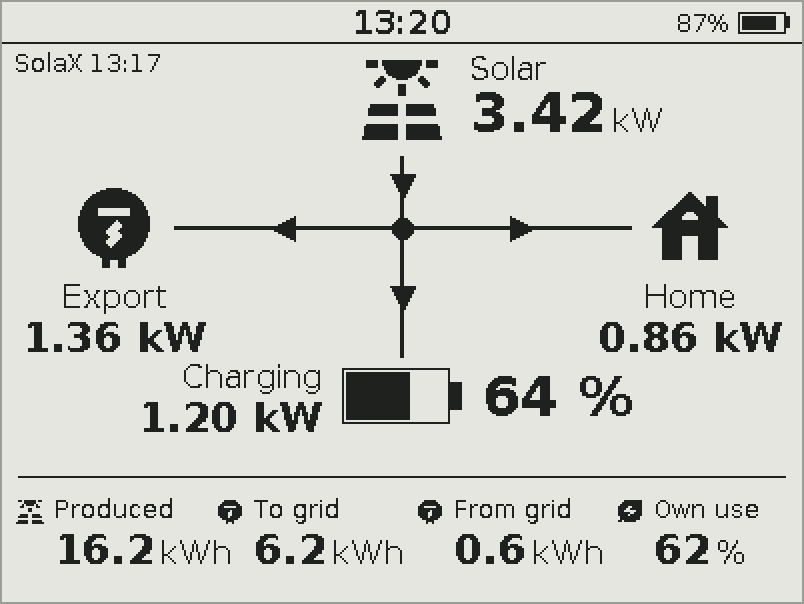</p>

<p>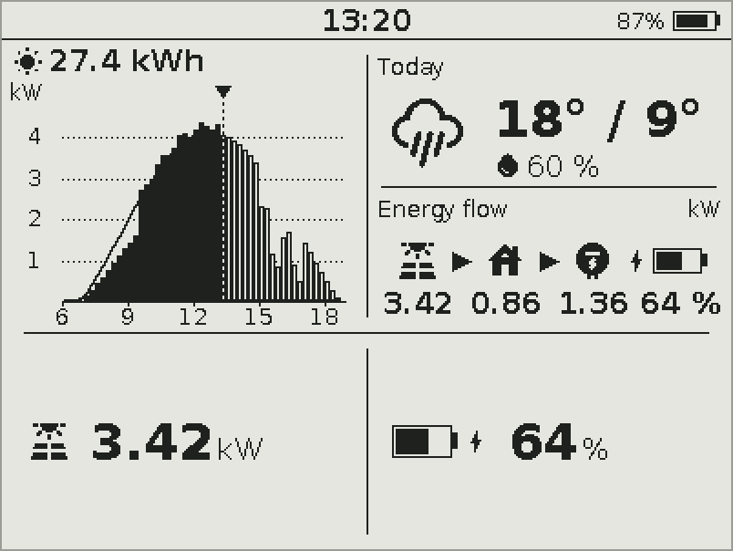</p>

### The forecast

Choose where the forecast comes from:

| Source | Needs | What it gives |
|---|---|---|
| Open-Meteo | Nothing: no account. The default | The sun on your roof's tilt and direction, through the device's own PV model: your panels' kWp, the system's losses (14 % by default) and the inverter's limit. Three days, a quarter hour at a time |
| [Forecast.Solar](https://forecast.solar) | Without a key: one plane. With a key: two | Its own forecast for your planes: hourly for today and tomorrow without a key; with one, finer steps and more days, as the account allows |
| [Solcast](https://solcast.com) | A key and one or two rooftop sites, set up on solcast.com | Its forecast for the sites, which know your roof. A free hobbyist account has 10 calls a day, so the device asks at most every 3 hours with one site and every 6 with two, and keeps the forecast it has in between |

A roof can have two planes, each with its own kWp, tilt and azimuth (0 is south, −90 east, 90 west). The Solar step runs with each sync: the forecast follows the weather's schedule, so the morning sync brings the day.

### The house's energy

The house's energy comes from [SolaX Cloud](https://www.solaxcloud.com), where SolaX inverters report about every 5 minutes. There are two ways in:

- **SolaX Cloud, Developer API**: the Client ID and Client Secret of an application you create at [developer.solaxcloud.com](https://developer.solaxcloud.com), and the region your account is in (Europe, China or India). The device logs in with them and finds your plant and its inverter, battery and meter itself. Today's totals are SolaX's own.
- **SolaX Cloud, Token ID**: for older accounts that have a Token ID on solaxcloud.com's API page, with the registration number on the dongle's label. SolaX sends the totals to and from the grid since installation here, so the device needs a reading within an hour of midnight to start each day's count. Sync mode Always on brings one, and so does a sync time such as 00:05. Without one, the day's totals to and from the grid stay dashes.

A reading comes with each sync, and every 5 minutes in sync mode Always on. A reading counts as fresh for 15 minutes. If the house's reading fails, the Sync page and the Solar page say why, but the sync itself doesn't count as failed: the next reading soon replaces it.

Powers under 1 kW show in watts, as the SolaX app shows them; from 1 kW in kW. The Energy flow in a small slot uses one unit for all its numbers: W while every power is under 1 kW.

The home battery shows when you set it to show, or by itself when the inverter is a hybrid or a reading has a charge above 0 %. On the Energy layout, arrows show where at least 20 W flow and dotted lines where less does. Own use is the share of the day's output that the house used itself.

### The Solar page

<p>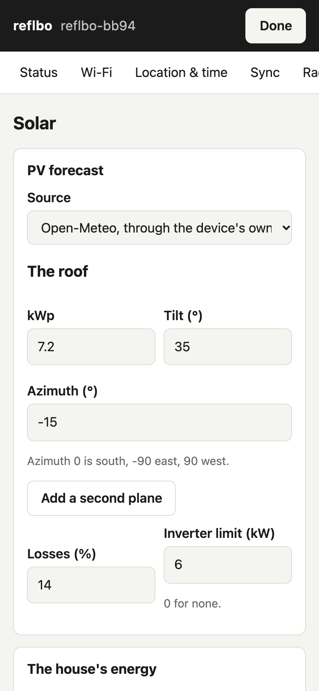 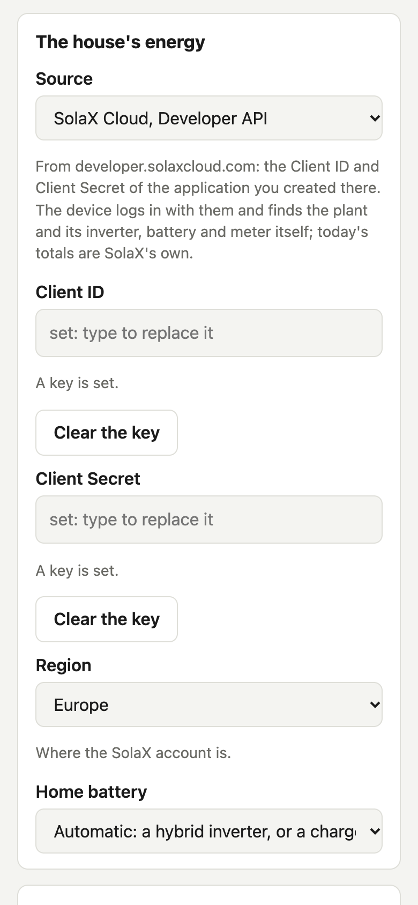</p>

Keys, tokens, site ids, Client IDs and Secrets are write-only: the page only says whether each is set, and backups never include them. Check now runs the forecast and the house's reading at once and shows what they brought. The page also shows when the forecast and the reading came, and the SolaX plant the Developer API found.

[Open-Meteo](https://open-meteo.com) is used under CC BY 4.0, Forecast.Solar's data under CC BY-SA 4.0, and Solcast's for personal use only, as its terms say.

## The menu

Hold KEY to open the menu. KEY moves to the next item and, held, opens it; BOOT goes back. A value is changed with KEY (+) and BOOT (−), then saved by holding KEY.

| Section | Items |
|---|---|
| Presets | The active preset, auto-cycle, its interval, the schedule on or off |
| Wi-Fi | Wi-Fi setup, forget networks, reset the web password |
| Sync | Sync now, the schedule, the interval, quiet hours on or off, the steps |
| Time | Set the date and time, 24-hour clock, the time zone |
| Display | How often the dashboard is redrawn (1–15 min), the panel's refresh rate (0.25–8 Hz) |
| Sensors | Temperature and humidity offsets, °C or °F |
| Info | Battery, firmware, device name, IP and MAC address, the last sync, uptime |
| System | Language, restart, factory reset (confirmed by holding KEY) |

<p> 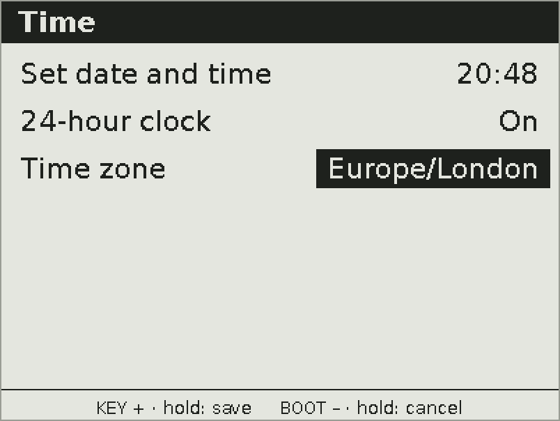</p>

## Wi-Fi and the web configurator

The device remembers up to 5 networks and tries the last good one first. It is reachable as `reflbo-XXXX.local`, where `XXXX` comes from its MAC address.

The web page runs on the device and works on a phone. It is up only while you need it: in Wi-Fi setup (hold BOOT for 3 s), or on your network all the time in sync mode Always on. Wi-Fi setup ends with Done on the page, by holding BOOT, or after 10 minutes without use. While a phone is logged in, the screen shows the dashboard, so changes show as you make them.

| Page | What it holds |
|---|---|
| Status | What the screen shows now, the device, the time, battery and sensors, Wi-Fi, the last sync; the password, logging out, restart |
| Wi-Fi | Saved networks; add one from a scan, tested before it is saved |
| Location & time | A place search, the coordinates, the time zone, 12- or 24-hour clock, setting the clock from the phone |
| Sync | The last sync step by step, Sync now, the schedule and quiet hours, the steps, the clock chip's trim |
| Radar | Both radars' centre, zoom or range, and filters, with live previews |
| Solar | The PV forecast's source and roof, the house's energy and its keys, Check now |
| Device | Language, units, sensor offsets and interval, the redraw interval and refresh rate, the battery's calibration |
| Presets | The presets, their editor with a live preview, the auto-cycle and the schedule |
| Firmware | The running version, and updates |
| Backup | Download and restore the settings; factory reset |

<p> 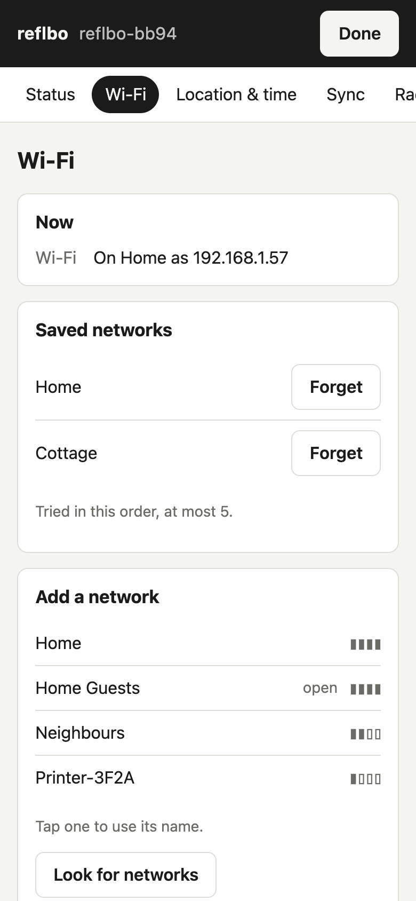 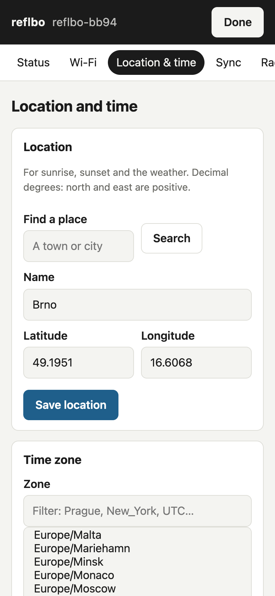</p>
<p>  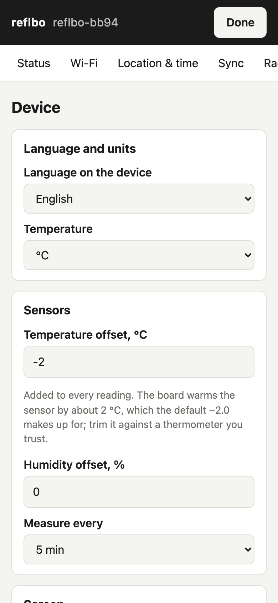</p>

The page asks for a password, chosen on the first visit from a phone on the device's own network. After five wrong passwords it waits a minute. Wi-Fi passwords and the web password are never shown again or included in backups. On your network the page answers only to its own name or address. If you forget the password, reset it in the menu: Wi-Fi ▸ Reset web password.

## Syncing

A sync turns Wi-Fi on, sets the clock, fetches the forecast, the air quality, a radar frame, the solar forecast and the house's reading, then turns Wi-Fi off again. The radio is on for at most 45 seconds; a typical sync takes 3 to 4. A failed sync is tried again after 15, 30 and 60 minutes, except on a low battery. The house's reading failing alone fails no sync.

| Mode | When |
|---|---|
| At set times | At up to 8 times a day; 05:30 by default |
| Every interval | Every 15 minutes to 24 hours |
| Always on | Wi-Fi stays on: the weather every hour, the radar every 5 minutes, the flight radar, and the web page on your network. Meant for USB power |
| Only when asked | From the menu, the web page or the console |

Quiet hours stop syncs from starting at night; a sync due then runs as they end. In Always on, Wi-Fi goes off for them. BOOT double on the dashboard switches Always on on and back to the mode before.

Each step but the time can be switched off, on the Sync page or in the menu's Sync ▸ Steps: a step that is off makes no requests, and its data age out as usual. The time always runs, as the clock and its trim need it. The solar forecast and the house's energy also need their source set on the Solar page.

<p>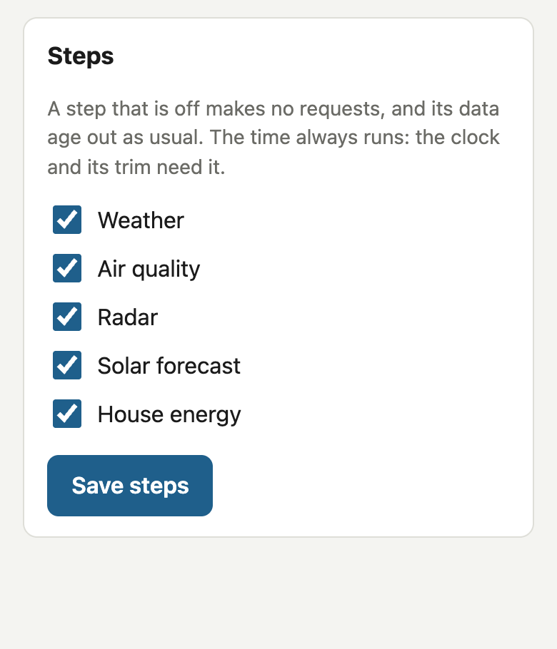</p>

Info in the menu shows the last sync's time and the first step that failed. The Sync page shows every step.

## Time

The PCF85063 clock chip keeps the time through sleep and runs the device's wake-ups. Each sync sets it from NTP to the millisecond, and measures how far it drifted since the last one. This board's crystal runs about 3.4 s a day slow, so the device trims the chip once two syncs are at least 20 hours apart.

The board has no backup cell for the clock yet: switched off with PWR, it loses the time. At the next start it syncs at once if Wi-Fi is set up; otherwise the status bar says "Set time". The web page sets the clock from the phone when it finds it lost.

Time zones come from the full IANA list on the web page, or a short list in the menu. Daylight saving follows the zone's rules.

## Battery and power

The level comes from the cell's voltage through a Li-ion curve. On the Device page you can enter your own full and empty voltages, or let the device learn this cell's curve from one full discharge, about a week. Charging is worked out from the voltage rising, as the board has no charge signal.

- Below 15 % the status bar marks the battery and failed syncs aren't retried.
- At 3.3 V the "Battery empty" screen stays until the cell is charged. Only KEY wakes the device then.

<p>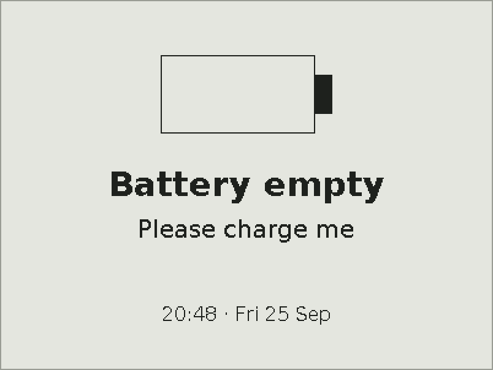</p>

The device sleeps between wake-ups: light sleep by default, with about 60 ms awake per minute. A daily sync costs about 0.1 mAh. The stock board's 3.3 V converter is stuck in its forced-PWM mode, though, and draws about 60 mW whatever the firmware does. That sets battery life at roughly 9 days on a 3400 mAh cell, an estimate from the measured floor. A board rework, the converter's PS/SYNC pin tied to ground, would enable its power-save mode. Measurements are in [power.md](power.md).

## Languages

The device speaks English and Czech: the menu, the fields, weekdays, months and number formats. Czech also brings the public holidays. Name days wait for a source whose licence allows redistribution. The web page is in English.

<p>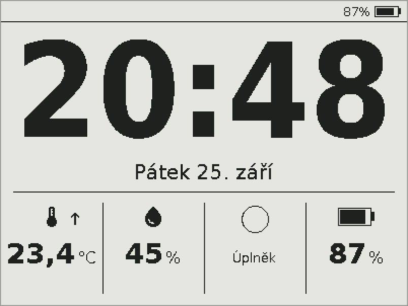</p>

## Updates, backup and reset

- **Firmware updates** go through the Firmware page: upload `reflbo.bin` from a build. The device checks the image, writes it beside the running one and restarts into it. If the new firmware doesn't run properly for its first minute, the device goes back to the previous one.
- **Backup** downloads the settings and presets as one JSON file, without passwords or keys. Restore checks every file before it replaces anything. A second Forecast.Solar plane waits for its key, which a backup doesn't carry: the forecast uses the first plane until you set one.
- **Factory reset**, in the menu or on the Backup page, erases the settings, presets, saved networks and the web password, then restarts with the first-run screen.

## For developers

Everything that draws can be checked without looking at the device. The firmware renders on the host for tests, and over USB the console takes screenshots, injects values and presses buttons:

```sh
tools/idf.sh exec python tools/screenshot.py -o captures/screen.png
tools/idf.sh exec python tools/devlog.py --cmd "field set env.temp -5.5" --cmd "btn key short"
```

[AGENTS.md](../AGENTS.md) has the build, the console commands and the hardware notes. The [design spec](specs/2026-09-25-firmware-design.md) has every decision, and the [plans](plans/) show how each milestone was built. `python3 tools/docs_images.py` makes the panel images in this guide from the golden renders.

## Coming next

- **MQTT and Home Assistant (M7, designed).** The device's sensors and state in Home Assistant through MQTT discovery; its preset as a select; Sync now and Next preset as buttons; key presses as device triggers; a message from Home Assistant as a banner; and values from Home Assistant or other devices as fields on the dashboard.
- **Audio (M8, planned).** Alarms that ring from sleep, with snooze; internet radio.
- **microSD (M9, planned).** Uses to be agreed, such as history and graphs, sounds and station lists, or a detailed map.

The roadmap is in [AGENTS.md](../AGENTS.md#2-status-and-roadmap).
